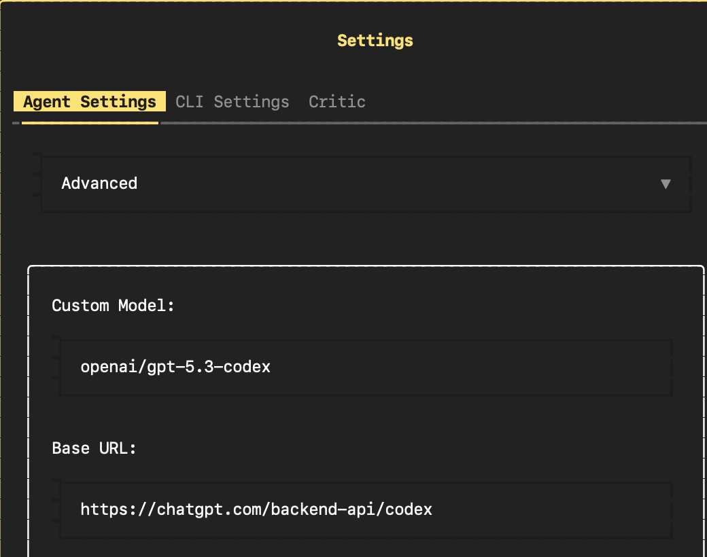

# OpenHands CLI with ChatGPT Codex Subscription

This folder contains the two helper scripts needed to run OpenHands CLI with your ChatGPT Codex subscription instead of paying through an API key or the OpenHands Cloud LLM proxy.



Use this if you want:

- OpenHands CLI
- OpenAI Codex models such as `gpt-5.3-codex` or `gpt-5.4-codex`
- authentication through your ChatGPT subscription

## Files

- `login.py`: one-time ChatGPT OAuth login helper
- `openhands-codex`: runner script that starts OpenHands CLI with the required Codex subscription patches

## What This Changes

The stock `openhands` CLI does not automatically use your ChatGPT subscription. This runner makes OpenHands CLI talk to the ChatGPT Codex backend directly:

```text
OpenHands CLI -> chatgpt.com/backend-api/codex -> your ChatGPT subscription
```

instead of:

```text
OpenHands CLI -> llm-proxy.app.all-hands.dev -> billed provider/API path
```

## Prerequisites

- Python 3.10+
- `uv`
- Docker
- a ChatGPT subscription with access to Codex models

## 1. Install OpenHands CLI

Clone or open your OpenHands CLI checkout, then create a virtual environment and install dependencies:

```bash
uv venv
source .venv/bin/activate
uv pip install openhands-ai authlib
```

If you are working from the OpenHands source repo instead of a published package, install your local checkout the way that repo expects.

## 2. Add These Scripts

Place these files in your OpenHands CLI working directory:

- `login.py`
- `openhands-codex`

Make the runner executable:

```bash
chmod +x openhands-codex
```

## 3. Configure OpenHands

Create or update `~/.openhands/config.toml`:

```toml
[llm]
model = "openai/gpt-5.3-codex"
api_key = "not-needed"
temperature = 0.0

[sandbox]
trusted_dirs = ["/Users/yourname/Code/yourproject"]

[llm.condenser]
model = "openai/gpt-5.3-instant"
api_key = "not-needed"
temperature = 0.1
```

Notes:

- The runner reads `[llm].model` and uses that as the Codex model.
- The condenser model in `config.toml` does not control the subscription path directly; the runner replaces both the main LLM and condenser at runtime.
- `api_key = "not-needed"` is just a placeholder so OpenHands config stays happy.
- Replace `"/Users/yourname/Code/yourproject"` with the actual local project directory you want OpenHands to work in, for example `"/Users/rajiv.shah/Code/openhands-cli-codex"`.

## 4. Authenticate Once

Run:

```bash
uv run login.py
```

This signs you in with ChatGPT and stores credentials in:

```bash
~/.openhands/auth/openai_oauth.json
```

## 5. Start OpenHands with Codex

Run:

```bash
uv run ./openhands-codex
```

or:

```bash
./openhands-codex
```

If you want a global command:

```bash
ln -sf /path/to/openhands-codex ~/.local/bin/openhands-codex
```

Then you can run:

```bash
openhands-codex
```

## Optional: Keep Both Cloud and Codex Modes

If you already use the normal `openhands` command for OpenHands Cloud, you can keep both:

```bash
openhands          # standard OpenHands / Cloud path
openhands-codex    # ChatGPT subscription Codex path
```

## Why The Custom Runner Is Needed

OpenHands CLI currently needs a few runtime patches to work cleanly with the ChatGPT Codex subscription backend.

The runner does the following for you:

- loads your ChatGPT OAuth token from `~/.openhands/auth/openai_oauth.json`
- points requests to `https://chatgpt.com/backend-api/codex`
- adds the required Codex headers
- replaces the persisted OpenHands LLM settings at runtime so stale Cloud settings do not win
- replaces the condenser LLM too
- strips unsupported request fields such as `prompt_cache_retention`
- keeps requests stateless with `store=false`
- avoids replaying prior assistant reasoning items with `rs_*` ids, which break follow-up turns

Without these patches, OpenHands may appear to start correctly but then fail on later requests.

## Troubleshooting

### I still see `llm-proxy.app.all-hands.dev`

That usually means your normal OpenHands CLI is still using persisted Cloud settings from:

```bash
~/.openhands/agent_settings.json
```

That is expected for bare `openhands`.

For `openhands-codex`, the runner overrides those settings at runtime, so seeing old saved Cloud config does not necessarily mean the Codex runner is broken.

### Should I continue an old broken session?

No. Restart the `openhands-codex` session after updating the runner.

### Should I set `stream=False` to fix `Streaming requires an on_token callback`?

No. That change can break otherwise working conversations in this setup.

The correct behavior for this runner is the original `stream=True` configuration in `openhands-codex`. If you hit a transient streaming-related error, do not "fix" it by flipping the runner to `stream=False` unless you have confirmed a newer OpenHands/SDK version actually requires a different transport contract.

### Can I change the model?

Yes. Change `[llm].model` in `~/.openhands/config.toml` to another Codex model your account supports, then restart `openhands-codex`.
